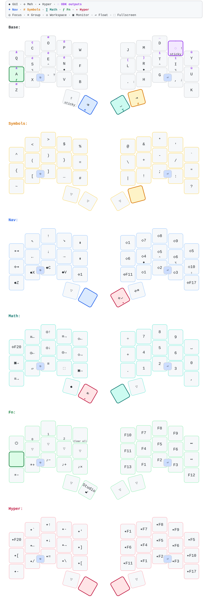

# ZMK Configuration for DokoDemo

!> [!WARNING]

> This repo currently hosts my personal keymap based on Ergo-L

## Current keymap



Regenerate the parsed keymap and SVG with:

```sh
make keymap
```

This uses the globally installed `keymap` executable. Saving
`keymap-drawer/keymap.yaml` in VS Code also redraws the SVG when the recommended
Run on Save extension is installed.
